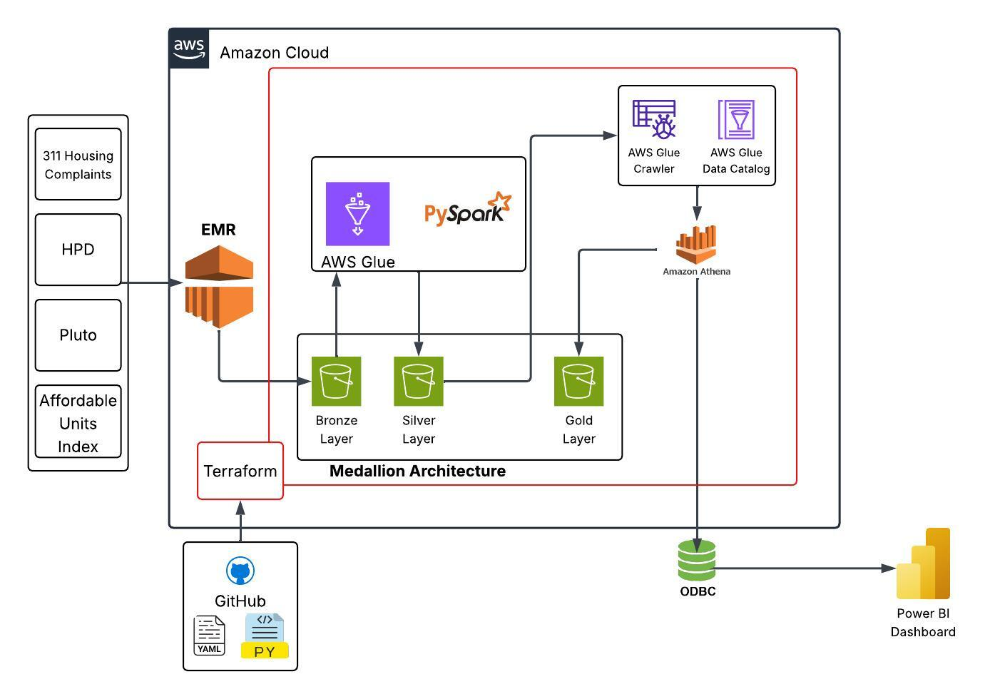
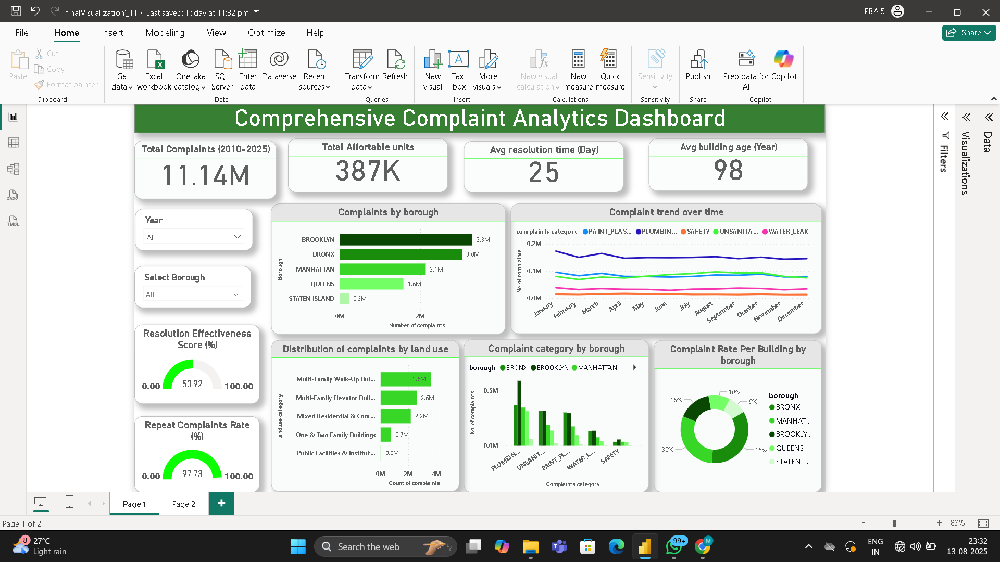
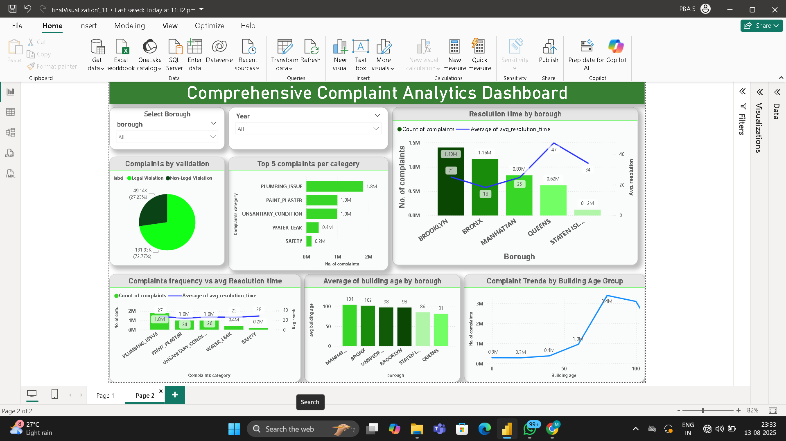

# nyc-housing-analytics
# NYC Housing Complaints analysis & prediction

This repository contains the source code, data pipeline scripts, and documentation for our group project: **NYC Housing Complaints analysis & Prediction using Big Data & Machine Learning**.

## 📌 Project Overview

With rapid urbanization in New York City, housing-related complaints (e.g., heating, plumbing, safety) are on the rise. This project leverages Big Data tools and Machine Learning models to analyze 311 housing complaints and other datasets to:

- Predict complaint trends
- Score neighborhoods/buildings on livability
- Aid decision-makers (tenants, housing officials, real estate agencies)

## 👨‍💻 Team Members (Group 4)

- Team Leader: Chetan Swaroop Sapedi  
- Members: Prateek Kulshrestha,Vedika Mule, Rushikesh Pabalkar, Sonu Lad, Abhishek Singh, Anannya Sarkar, Shakyadita Sonawane

## 🧠 Problem Statement

Unstructured and large-scale housing data makes it difficult to evaluate complaint-prone zones and livability conditions. We aim to:
- Predict future housing complaints using ML
- Generate an Affordable Living Index
- Provide interactive dashboards for all stakeholders

## 🔗 Data Sources

| Dataset | Source | Purpose |
|--------|--------|---------|
| 311 Complaints | [Link](https://data.cityofnewyork.us/Social-Services/311-Service-Requests-from-2010-to-Present/erm2-nwe9) | Complaint prediction |
| HPD Maintenance | [Link](https://data.cityofnewyork.us/Housing-Development/Housing-Maintenance-Code-Complaints-and-Problems/ygpa-z7cr) | Issue validation |
| PLUTO | [Link](https://data.cityofnewyork.us/City-Government/Primary-Land-Use-Tax-Lot-Output-PLUTO-/64uk-42ks) | Building metadata |
| Building Footprints | [Link](https://data.cityofnewyork.us/City-Government/BUILDING/5zhs-2jue) | Geo mapping |

## 🛠️ Tech Stack

| Layer | Tools/Technologies |
|------|--------------------|
| Cloud | AWS S3, EMR |
| Data Processing | PySpark, Pandas |
| ETL | AWS EMR, hadoop, hdfs, pyspark  |
| ML Models | PySpark MLlib, Scikit-learn |
| Visualization | Power BI |
| Storage | S3 (Data Lake), Redshift (MySQL Warehouse) |

## 📊 Project Flow

1. 📥 Ingest Data from NYC Open Data into S3  
2. 🔁 Transform data using AWS emr & hadoop  
3. ⚙️ Process Large Data with Spark on EMR  
4. 🧠 Train ML Models to predict complaints   
6. 📊 Visualize in Power BI dashboards  
7. 🔄 Automate using AWS Lambda triggers

## ✅ Objectives

- Forecast complaints by location/type
- Score buildings using Affordable Living Index
- Empower tenants, officials, and urban planners

## 📌 Use Cases

- Tenants: Identify safe and well-maintained areas  
- Authorities: Prioritize inspection zones  
- Real Estate: Evaluate building livability for planning  
- Public: Check neighborhood scores via dashboards

## 🚀 Expected Deliverables

- ML model for complaint prediction
- Cloud data warehouse
- Visual dashboards
- End-to-end automated ETL pipeline

## 🔮 Future Scope

- Integrate crime/noise/health data
- Mobile/web dashboards for the public
- Real-time alerts to tenants and inspectors
- REST API deployment with AWS SageMaker

## 👥 Project Team – Group 4 (PG-DBDA, CDAC Mumbai)

- 👨‍💼 [@Chetan-3179](https://github.com/Chetan-3179) – Team Leader  
- 👨‍💻 [@Prateek26071998](https://github.com/Prateek26071998) – Team Member  
- 👨‍💻 [@ABHISHEK9000](https://github.com/ABHISHEK9000) – Team Member  
- 👨‍💻 [@mandar353](https://github.com/mandar353) – Team Member  
- 👨‍💻 [@rushikeshpabalkar90](https://github.com/rushikeshpabalkar90) – Team Member  
- 👩‍💻 [@Sarkaranannya9932](https://github.com/Sarkaranannya9932) – Team Member  
- 👩‍💻 [@shakya-official](https://github.com/shakya-official) – Team Member  
- 👩‍💻 [@VedikaMule](https://github.com/VedikaMule) – Team Member

## Architecture Diagram

## Dashboards

